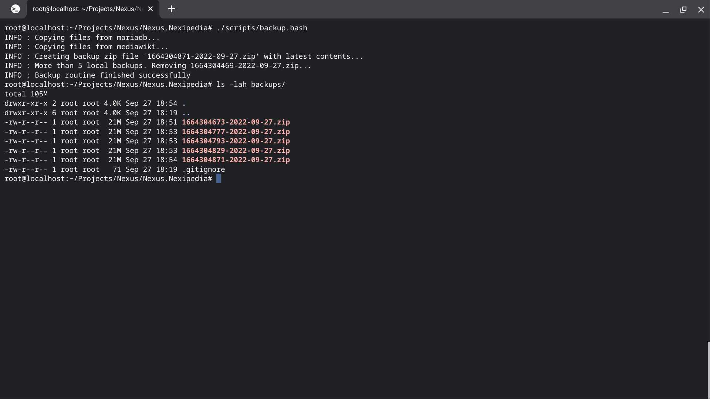

# nexipedia.net

## MediaWiki Extensions

- https://www.mediawiki.org/wiki/Extension:YouTube
- https://www.mediawiki.org/wiki/MediaWiki_Language_Extension_Bundle

## Server Installation Instructions (Ubuntu 22.04 LTS):

- https://www.mediawiki.org/wiki/Docker/Hub

```bash
docker-compose up
```

## Back up mediawiki/mariadb files

```bash
./scripts/backup.bash
```


